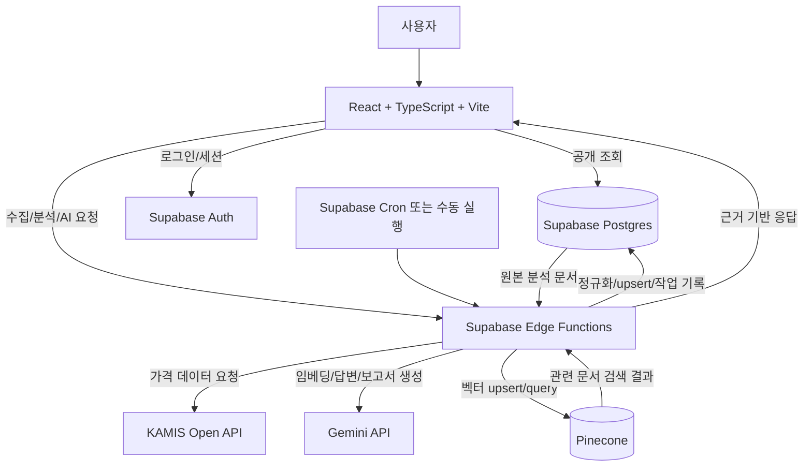
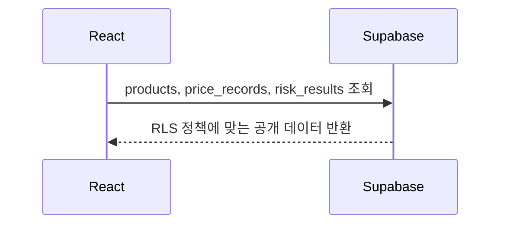
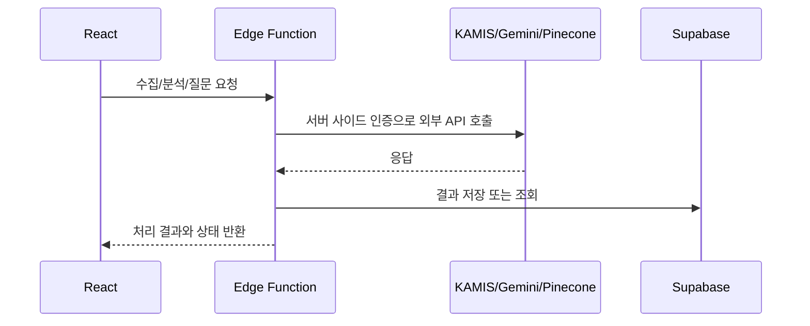

# 아키텍처 설계

## 1. 문서 목적

이 문서는 전남 특산 농수산물 가격 변동 및 수급 위험 분석 시스템의 전체 연결 구조와 책임 분리를 정의한다.

PRD의 Must Have 요구사항 `FR-01`부터 `FR-11`까지를 우선 구현 대상으로 두며, 별도 FastAPI 또는 Express 백엔드 서버 없이 Supabase Edge Functions를 서버리스 처리 계층으로 사용한다.

## 2. 핵심 원칙

1. Supabase Postgres를 Source of Truth로 둔다.
2. Pinecone은 Supabase 원본 데이터에서 생성되는 파생 검색 저장소로만 사용한다.
3. KAMIS, Gemini, Pinecone은 브라우저에서 직접 호출하지 않는다.
4. 외부 API 비밀키와 service role key는 브라우저 번들, 프론트엔드 env, 클라이언트 네트워크 요청에 노출하지 않는다.
5. 일부 품목 수집, 분석, 벡터 동기화 실패가 전체 데이터 보존을 훼손하지 않도록 작업 단위와 상태를 분리한다.
6. 위험 점수는 AI가 아니라 규칙 기반 로직으로 계산하고, AI는 근거 설명과 보고서 생성을 담당한다.

## 3. 전체 시스템 구성

## 4. 구성 요소별 책임

| 구성 요소 | 책임 | 직접 접근 가능한 대상 |
|---|---|---|
| React 웹 앱 | 대시보드, 가격 추이, 위험 분석, 보고서, 채팅, 시스템 상태 화면 표시 | Supabase anon client, Edge Functions |
| Supabase Auth | 로그인 사용자 식별, 사용자별 데이터 격리 기준 제공 | Supabase |
| Supabase Postgres | 품목, 가격, 위험 결과, 분석 문서 원본, 보고서, 대화, 피드백, 작업 이력 저장 | React 읽기, Edge Functions 읽기/쓰기 |
| Supabase Edge Functions | 외부 API 호출, 데이터 수집, 위험 분석, 문서 생성, 임베딩, Pinecone 동기화, RAG 답변 | Supabase, KAMIS, Gemini, Pinecone |
| Supabase Cron | 정기 수집과 분석 작업 트리거 | Edge Functions |
| KAMIS Open API | 가격 원천 데이터 제공 | Edge Functions만 |
| Gemini API | 임베딩 생성, RAG 답변 생성, 보고서 생성 | Edge Functions만 |
| Pinecone | 분석 문서 벡터 검색 | Edge Functions만 |

## 5. 브라우저 직접 호출 금지 대상

브라우저 또는 React 코드에서 다음 대상은 직접 호출하지 않는다.

| 대상 | 금지 이유 | 허용 호출 위치 |
|---|---|---|
| KAMIS Open API | 인증값 노출 위험, 응답 검증 필요 | Supabase Edge Functions |
| Gemini API | API Key 노출 위험, 프롬프트와 근거 구성 보호 필요 | Supabase Edge Functions |
| Pinecone API | API Key 노출 위험, 원본 문서 ID와 namespace 관리 필요 | Supabase Edge Functions |
| Supabase service role | RLS 우회 권한이므로 브라우저 노출 금지 | Supabase Edge Functions, 로컬 관리 도구 |

브라우저에서 사용할 수 있는 값은 `VITE_SUPABASE_URL`, `VITE_SUPABASE_ANON_KEY`로 제한한다.

## 6. Supabase와 Pinecone의 역할 분리

| 구분 | Supabase Postgres | Pinecone |
|---|---|---|
| 성격 | 기준 데이터 저장소 | 파생 검색 인덱스 |
| 저장 데이터 | 품목, 가격, 위험 결과, 분석 문서 원본, 대화, 피드백, 작업 이력 | 분석 문서 임베딩 벡터와 검색 메타데이터 |
| 정합성 기준 | Supabase 행과 제약조건 | Supabase 원본 문서 ID와 content hash |
| 장애 시 대응 | 원본 보존, 작업 실패 기록 | Supabase 원본으로 재임베딩 후 재등록 |
| 삭제/재구축 | 직접 데이터 손실로 간주 | 재구축 가능한 캐시/인덱스로 간주 |

Pinecone 벡터 metadata에는 최소한 `analysis_document_id`, `document_type`, `product_id`, `period_start`, `period_end`, `content_hash`를 포함한다. RAG 답변에서는 Pinecone 검색 결과만으로 수치를 확정하지 않고 Supabase의 정형 데이터를 우선 조회한다.

## 7. 데이터 조회와 처리 경로

### 7.1 공개 조회 경로

품목 목록, 가격 데이터, 위험 결과는 일반 사용자도 조회 가능하게 설계한다. 다만 수정은 Edge Function 또는 service role만 가능하게 한다.

### 7.2 외부 연동 처리 경로

외부 API 응답은 Edge Function에서 파싱, 정규화, 검증한 뒤 Supabase에 저장한다.

## 8. 주요 Edge Functions 후보

| 함수 후보 | 목적 | 주요 테이블 |
|---|---|---|
| `sync-kamis-prices` | KAMIS 가격 데이터 수집, 정규화, upsert | `products`, `price_records`, `data_sync_jobs` |
| `calculate-risks` | 가격 데이터 기반 위험 점수와 등급 계산 | `price_records`, `risk_results`, `data_sync_jobs` |
| `generate-analysis-documents` | 위험 결과를 검색용 문서로 변환 | `risk_results`, `analysis_documents` |
| `sync-vectors` | Gemini 임베딩 생성 후 Pinecone upsert | `analysis_documents`, `vector_sync_jobs` |
| `ask-ai` | 질문 의도 분류, Supabase 수치 조회, Pinecone 검색 근거 수집 | `analysis_documents` |
| `generate-rag-answer` | Gemini 답변 생성, 대화/메시지 저장 | `conversations`, `messages`, `analysis_documents` |
| `generate-report` | 품목별 AI 분석 보고서 생성과 저장 | `reports`, `analysis_documents` |
| `retry-job` | 실패한 수집/분석/벡터 작업 재처리 | `data_sync_jobs`, `vector_sync_jobs` |

함수명은 구현 단계에서 Supabase 함수 디렉터리 구조와 맞춰 조정할 수 있다.

## 9. 실패 시 데이터 보존 원칙

### 9.1 KAMIS 수집 실패

1. 기존 `price_records`는 삭제하거나 덮어쓰지 않는다.
2. 실패한 품목, 지역, 기간, API action, 오류 메시지를 `data_sync_jobs`에 기록한다.
3. 같은 작업 안에서 다른 품목은 계속 처리한다.
4. 재처리는 실패한 품목/기간 단위로 실행한다.

### 9.2 위험 분석 실패

1. 계산 불가와 0점은 구분한다.
2. 데이터 부족, 결측, 유효 가격 없음 같은 사유를 `risk_results.evidence` 또는 작업 이력에 저장한다.
3. 이전 성공 위험 결과는 유지하고, 최신 계산 실패 상태를 별도 작업 이력으로 남긴다.

### 9.3 Gemini 임베딩 실패

1. `analysis_documents` 원본 문서는 Supabase에 그대로 보존한다.
2. `vector_sync_jobs`에 실패 상태와 오류 메시지를 기록한다.
3. Pinecone에 기존 벡터가 있더라도 Supabase 원본 문서의 상태를 기준으로 재동기화할 수 있게 한다.

### 9.4 Pinecone upsert 실패

1. Supabase 원본 문서와 위험 결과는 삭제하지 않는다.
2. 해당 문서를 `pending` 또는 `failed` 상태로 표시해 재처리 대상으로 남긴다.
3. 다음 동기화 때 `content_hash`가 같은 문서는 같은 벡터 ID로 재등록한다.

### 9.5 RAG 답변 실패

1. 사용자 질문과 실패 상태를 `messages`에 저장할 수 있다.
2. 답변 생성 실패와 근거 부족은 구분한다.
3. 근거가 부족하면 Gemini가 임의로 원인을 만들어내지 않도록 구조화된 오류 응답을 반환한다.

## 10. 인증과 권한 흐름 요약

| 데이터/동작 | anon 사용자 | authenticated 사용자 | Edge Function/service role |
|---|---|---|---|
| 품목/가격/위험 조회 | 가능 | 가능 | 가능 |
| 품목/가격/위험 수정 | 불가 | 불가 | 가능 |
| 작업 이력 요약 조회 | 가능 또는 제한적 가능 | 가능 또는 제한적 가능 | 가능 |
| 작업 이력 상세/재처리 | 불가 | 정책에 따라 제한 | 가능 |
| 자신의 대화 저장/조회 | 불가 또는 제한 | 가능 | 가능 |
| 다른 사용자 대화 조회 | 불가 | 불가 | 관리 목적만 가능 |
| 피드백 저장 | 불가 또는 로그인 필요 | 가능 | 가능 |

로그인 기능 포함 시점은 미결정이지만, DB와 RLS는 로그인 사용자별 대화와 피드백 격리를 전제로 설계한다.

## 11. 모델과 인덱스 기준

| 항목 | 확정/권장 값 |
|---|---|
| 생성 모델 | `gemini-3.5-flash` |
| 임베딩 모델 | `gemini-embedding-2` |
| 임베딩 출력 차원 | `1024` |
| Pinecone 인덱스 이름 | `toy-project-2` |
| Pinecone metric | `cosine` 권장 |

Gemini 임베딩 호출 시 Pinecone 인덱스 dimension과 맞추기 위해 `outputDimensionality: 1024`를 지정한다.

## 12. 관련 요구사항

| 요구사항 | 반영 위치 |
|---|---|
| FR-01 | React가 Supabase에서 활성 품목 조회 |
| FR-02 | Edge Function이 KAMIS 수집 |
| FR-03 | Supabase unique constraint와 upsert |
| FR-04 | React 대시보드 공개 조회 |
| FR-05 | Supabase 가격 추이 조회 |
| FR-06, FR-07 | Edge Function 위험 분석과 Supabase 저장 |
| FR-08, FR-09 | 분석 문서 생성과 Pinecone 동기화 |
| FR-10, FR-11 | RAG Edge Function과 근거 표시 |
| NFR-01 | 브라우저 직접 호출 금지와 Secrets 관리 |
| NFR-04, NFR-05 | 작업 단위 실패 기록과 재처리 |
| NFR-06 | Supabase 원본 문서 ID와 Pinecone 벡터 연결 |
