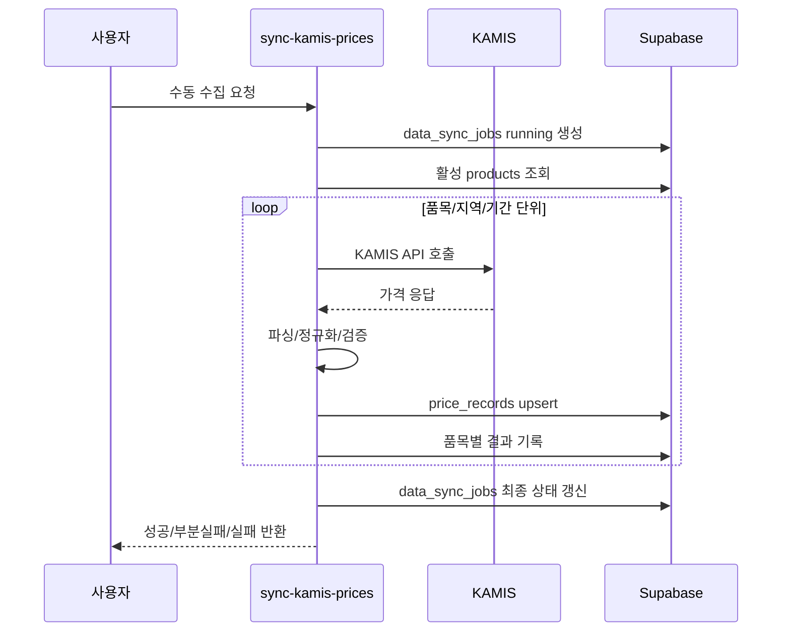
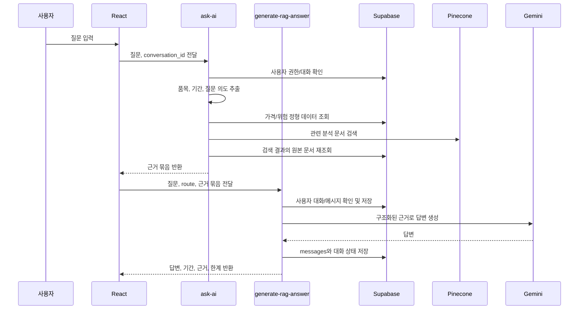

# 데이터 워크플로 설계

## 1. 문서 목적

이 문서는 가격 데이터 수집부터 위험 분석, 검색용 문서 생성, Gemini 임베딩, Pinecone 동기화, RAG 질의응답, 실패/재처리까지의 데이터 흐름을 정의한다.

기준 저장소는 Supabase Postgres이며, Pinecone은 Supabase 원본 문서에서 파생된 검색 인덱스로 사용한다.

## 2. 전체 흐름

```mermaid
flowchart LR
    A[수동 실행] --> B[data_sync_jobs 생성]
    B --> C[KAMIS 가격 수집]
    C --> D[파싱/정규화/검증]
    D --> E[price_records upsert]
    E --> F[위험 분석]
    F --> G[risk_results 저장]
    G --> H[analysis_documents 생성]
    H --> I[Gemini 임베딩 생성]
    I --> J[Pinecone upsert]
    J --> K[vector_sync_jobs 기록]
    K --> L[RAG 질의응답 근거로 사용]
```



## 3. 공통 작업 상태

수집, 분석, 벡터 동기화는 작업 이력으로 추적한다.

| 상태 | 의미 |
|---|---|
| `pending` | 작업 생성 후 아직 처리 전 |
| `running` | 처리 중 |
| `success` | 전체 또는 해당 단위 처리 성공 |
| `partial_success` | 일부 품목 또는 일부 문서 실패 |
| `failed` | 해당 작업 실패 |
| `retrying` | 실패 작업 재처리 중 |
| `skipped` | 데이터 없음, 중복, 변경 없음 등으로 처리 생략 |

오류 메시지는 사용자가 이해할 수 있는 요약과 개발자가 확인할 수 있는 원문 일부를 분리해 저장한다. 비밀키, 인증 헤더, 전체 외부 API 요청 URL은 저장하지 않는다.

## 4. 가격 데이터 수집 흐름

### 4.1 목적

KAMIS Open API에서 품목별 최신 시세와 기간 가격 데이터를 수집해 `price_records`에 저장한다.

### 4.2 사용 API

| 목적 | KAMIS action | 사용 화면/기능 |
|---|---|---|
| 대시보드 최신 시세 | `dailyCountyList` | 전체 대시보드 |
| 기간 가격 추이 | `periodRetailProductList` | 가격 추이, 위험 분석 |
| 품목/품종/등급 코드 확인 | `productInfo` | 초기 seed와 코드 검증 |

초기 품목 후보는 배추 `211`, 무 `231`, 양파 `245`, 대파 `274`이며, 지역 후보는 순천 `3613`, 목포 `3611`, 광주 `2401`이다. 실제 KAMIS 요청 가능 여부에 따라 seed 작성 단계에서 조정한다.

### 4.3 처리 단계



현재 프로젝트의 4.3는 정기 스케줄을 두지 않고, 사용자가 필요할 때 `sync-kamis-prices`를 직접 호출하는 방식으로 운영한다.

권장 수동 실행 방식:

1. 로컬 또는 배포된 Edge Function 엔드포인트에 `POST` 요청을 보낸다.
2. `mode`를 `daily` 또는 `period`로 지정한다.
3. `daily`는 `productIds`를 비우고 `countyCodes`만 넣어 전체 활성 품목의 최신 시세를 수집한다.
4. `period`는 `productIds`, `countyCodes`, `startDate`, `endDate`를 모두 넣어 특정 품목의 기간 가격을 수집한다.
5. `countyCodes`는 하나 이상 입력한다. 기본값은 `3613`이다.
6. `startDate`와 `endDate`는 `YYYY-MM-DD` 형식을 사용하고, `startDate <= endDate`를 지킨다.
7. 필요한 경우 `mock: true`로 테스트 데이터를 쓴다.
8. 실행 결과는 `data_sync_jobs`와 `price_records`에서 확인한다.

### 4.4 정규화 기준

| 입력 필드 | 저장 방향 |
|---|---|
| `productno`, `itemcode` | `products.kamis_item_code`와 매핑 |
| `category_code`, `itemcategorycode` | `products.kamis_category_code` |
| `county_code`, `p_countrycode` | `price_records.county_code` |
| `product_cls_code` | 소매/도매 구분 코드로 저장 |
| `unit` 또는 출하단위 | 표시 단위로 저장 |
| `day1`, `regday` | `price_records.price_date` |
| `dpr1`, `price` | 쉼표 제거 후 numeric 가격 |
| `direction`, `value` | 원본 변화 방향/변화율 메타데이터 |

`price`가 비어 있거나 `-`, `품절`, `조사 안함`처럼 숫자가 아닌 경우에는 가격 행을 무조건 실패로 보지 않고 데이터 없음 또는 결측 상태로 기록한다.

### 4.5 중복 방지

동일 가격 데이터는 최소한 다음 조합으로 중복 저장을 방지한다.

```text
product_id + price_date + county_code + product_cls_code + market_name + source
```

PRD의 "동일 품목·동일 날짜 중복 방지"를 만족하면서도 지역, 도소매, 시장 차이를 잃지 않기 위한 기준이다. 구현 시 `market_name`이 없는 API는 빈 문자열 대신 `NULL` 처리와 unique index 설계를 함께 고려한다.

## 5. 위험 분석 흐름

### 5.1 목적

저장된 가격 데이터로 재현 가능한 규칙 기반 위험 점수와 등급을 계산해 `risk_results`에 저장한다.

### 5.2 입력 데이터

| 입력 | 출처 |
|---|---|
| 품목 정보 | `products` |
| 기간 가격 데이터 | `price_records` |
| 분석 기간 | 사용자 선택 또는 기본 기간 |
| 품질 정보 | 결측 수, 유효 가격 수, 최근 수집 시각 |

기본 분석 기간은 요청값이 없으면 최근 30일로 둔다. 품목과 지역을 지정하지 않으면 활성 품목 전체와 기본 지역 `3613`을 사용한다.

### 5.3 계산 지표

| 지표 | 설명 |
|---|---|
| 기간 변화율 | 분석 시작 가격 대비 종료 가격 변화율 |
| 최근 변화율 | 최근 가격과 직전 기준 가격의 변화율 |
| 변동성 | 분석 기간 내 가격 표준편차 또는 일별 변화율 표준편차 |
| 데이터 품질 | 유효 가격 수, 결측 비율, 최근성 |

최종 점수는 부분 점수와 가중치를 `risk_results.evidence`에 저장해 사용자가 계산 근거를 확인할 수 있게 한다.

초기 가중치:

| 항목 | 가중치 |
|---|---|
| 기간 변화율 | 35 |
| 최근 변화율 | 20 |
| 변동성 | 25 |
| 데이터 품질 | 20 |

### 5.4 등급 기준

| 등급 | 기준 | 의미 |
|---|---|---|
| `insufficient_data` | 유효 가격 5개 미만, 결측 비율 50% 초과, 최신 가격 없음 | 계산 불가 |
| `high` | `risk_score >= 70` | 우선 확인 필요 |
| `watch` | `40 <= risk_score < 70` | 주의 필요 |
| `stable` | `risk_score < 40` | 상대적으로 안정 |

`insufficient_data`는 점수 계산과 분리한다. 데이터가 부족하면 점수를 억지로 환산하지 않고 `risk_score`를 `NULL`로 저장한다.

### 5.5 구현 함수

4.4 구현 산출물은 `supabase/functions/calculate-risks/index.ts`이다.

처리 흐름:

1. 요청의 `productIds`, `countyCodes`, `startDate`, `endDate`를 검증한다.
2. `data_sync_jobs`에 `risk_analysis` 작업을 생성한다.
3. `price_records`에서 기간 가격 데이터를 조회한다.
4. 데이터 충분성 기준을 먼저 검사한다.
5. 계산 가능한 경우 부분 점수와 최종 점수를 계산한다.
6. 기존 최신 위험 결과의 `is_latest`를 해제하고 새 결과를 `risk_results`에 upsert한다.
7. 작업 결과를 `data_sync_jobs`에 기록한다.

## 6. 검색용 문서 생성 흐름

### 6.1 목적

`risk_results`와 가격 요약을 자연어 검색 가능한 문서로 변환해 Supabase `analysis_documents`에 저장한다.

### 6.2 문서 생성 기준

검색용 문서에는 다음 내용을 포함한다.

1. 품목명, 지역, 단위
2. 분석 기간
3. 기간 시작/종료/최고/최저/평균 가격
4. 변화율, 변동성, 데이터 품질
5. 위험 점수, 등급, 부분 점수와 가중치
6. 데이터 한계와 결측 정보
7. 문서 생성 시각과 원본 `risk_result_id`

문서 본문은 AI 답변의 근거로 쓰이므로 숫자와 기간을 명확하게 적고, "예측"처럼 범위 밖 표현은 넣지 않는다.

### 6.3 content hash

`analysis_documents.content_hash`는 문서 본문과 주요 메타데이터를 기준으로 만든다.

동일한 `risk_result_id`에서 내용이 바뀌지 않았으면 새 임베딩을 만들지 않고 `skipped` 처리할 수 있다. 내용이 바뀌면 문서 버전을 증가시키고 Pinecone에 같은 원본 기준의 새 벡터를 upsert한다.

### 6.4 구현 함수

검색용 문서 생성은 `generate-analysis-documents` Edge Function에서 수행한다.

입력 규칙:

1. 요청 본문이 비어 있으면 최신 `risk_results` 전체를 대상으로 한다.
2. `riskResultIds`가 있으면 해당 위험 결과만 대상으로 한다.
3. `productIds`, `countyCodes`로 대상을 좁힐 수 있다.
4. `onlyLatest` 기본값은 `true`다.
5. `includeInsufficientData` 기본값은 `true`다.

저장 규칙:

1. `data_sync_jobs.job_type = document_generation`으로 작업 이력을 남긴다.
2. 문서 타입은 `risk_summary`로 저장한다.
3. 원본 연결은 `source_table = risk_results`, `source_id = risk_results.id`, `risk_result_id = risk_results.id`로 저장한다.
4. 새 문서는 `vector_status = pending` 상태로 저장한다.
5. 같은 원본의 최신 문서와 `content_hash`가 같으면 새 문서를 만들지 않고 `skipped`로 기록한다.
6. 내용이 바뀌면 기존 최신 버전보다 1 큰 `version`으로 새 문서를 만든다.

## 7. Gemini 임베딩 생성 흐름

### 7.1 목적

`analysis_documents` 본문을 Gemini 임베딩으로 변환해 Pinecone의 dense vector로 등록할 준비를 한다.

### 7.2 모델 기준

| 항목 | 값 |
|---|---|
| 임베딩 모델 | `gemini-embedding-2` |
| 출력 차원 | `1024` |
| Pinecone index | `toy-project-2` |

Gemini 임베딩 호출 시 `outputDimensionality: 1024`를 지정한다.

### 7.3 실패 처리

1. Gemini 호출 실패 시 `analysis_documents`는 보존한다.
2. `vector_sync_jobs`에 `failed` 상태를 기록한다.
3. 재처리 시 같은 `analysis_document_id`와 `content_hash`를 다시 확인한다.
4. 임베딩 차원이 1024가 아니면 Pinecone upsert 전에 실패로 처리한다.

### 7.4 구현 함수

벡터 동기화는 `sync-vectors` Edge Function에서 수행한다.

입력 규칙:

1. 기본값은 `vector_status in ('pending', 'failed')` 문서만 동기화한다.
2. `analysisDocumentIds`가 있으면 지정한 문서만 처리한다.
3. `force: true`면 이미 `synced`인 문서도 다시 임베딩하고 upsert한다.
4. `namespace`를 받지 않으면 `jeonnam-agri-analysis`를 사용한다.

저장 규칙:

1. `vector_sync_jobs`에 각 문서별 실행 이력을 기록한다.
2. 벡터 ID는 `analysis_document:{analysis_document_id}:v{version}`으로 만든다.
3. Pinecone metadata에는 원본 문서 ID와 필터용 최소 메타데이터만 넣는다.
4. 성공 시 `analysis_documents.vector_status = synced`로 바꾼다.
5. 실패 시 `analysis_documents.vector_status = failed`와 `vector_sync_jobs.failed`를 남긴다.

## 8. Pinecone upsert 흐름

### 8.1 목적

임베딩 벡터와 Supabase 원본 문서 ID를 Pinecone에 등록해 의미 기반 검색을 가능하게 한다.

### 8.2 벡터 ID 규칙 후보

```text
analysis_document:{analysis_document_id}:v{version}
```

보고서 문서를 별도 등록할 경우 다음 형식을 사용할 수 있다.

```text
report:{report_id}:v{version}
```

### 8.3 Pinecone metadata

| 필드 | 설명 |
|---|---|
| `source_table` | `analysis_documents` 또는 `reports` |
| `analysis_document_id` | Supabase 원본 문서 ID |
| `risk_result_id` | 위험 결과 ID |
| `product_id` | 품목 ID |
| `document_type` | `risk_summary`, `report`, `price_summary` 등 |
| `period_start` | 분석 시작일 |
| `period_end` | 분석 종료일 |
| `content_hash` | 원본 문서 내용 hash |
| `is_mock` | Mock 데이터 여부 |

Pinecone metadata에는 검색 필터에 필요한 최소 정보만 저장하고, 원본 본문과 정확한 수치는 Supabase를 기준으로 다시 확인한다.

## 9. RAG 질의응답 흐름

### 9.1 목적

사용자의 자연어 질문에 대해 Supabase 수치와 Pinecone 검색 근거를 결합해 Gemini로 답변을 생성한다.

5.4 단계에서는 질문 라우팅과 근거 수집까지만 구현하고, 최종 자연어 답변 생성과 저장은 5.5 단계에서 이어진다.

### 9.2 처리 단계



### 9.3 질문 유형별 처리

| 질문 유형 | 우선 데이터 |
|---|---|
| 현재 가격, 평균, 최고/최저 같은 수치 질문 | Supabase `price_records` |
| 위험 등급과 계산 근거 질문 | Supabase `risk_results` |
| 가격 변화 해석, 과거 유사 사례 질문 | Supabase 수치 + Pinecone 검색 문서 |
| 보고서 요약 요청 | `risk_results`, `analysis_documents`, Gemini |

수치가 필요한 질문은 Pinecone 검색 결과의 문장만 사용하지 않고 Supabase에서 원본 값을 다시 조회한다.

### 9.4 답변 필수 구조

AI 답변은 다음 정보를 포함해야 한다.

1. 핵심 답변
2. 사용한 품목과 기간
3. 주요 수치 근거
4. 사용한 분석 문서 목록
5. 데이터 한계 또는 근거 부족 여부

근거가 부족한 경우에는 "관련 근거가 부족하다"는 상태를 반환하고 추정 원인을 단정하지 않는다.

### 9.5 구현 함수

질문 라우팅은 `ask-ai` Edge Function에서 수행한다.

입력 규칙:

1. `question`은 필수다.
2. `productIds`, `countyCodes`, `startDate`, `endDate`는 사용자가 직접 주면 우선 적용한다.
3. 값이 없으면 질문 본문에서 품목, 지역, 의도 단서를 추출한다.
4. `routeHint`가 있으면 분류 결과보다 우선한다.

라우팅 규칙:

1. 숫자/시세 질문은 `price_records`와 `risk_results`를 우선 조회한다.
2. 설명/해석 질문은 질문 임베딩을 만들어 Pinecone을 검색한다.
3. 복합 질문은 두 경로를 모두 사용한다.
4. 판단이 모호하면 `ambiguous`로 표시하고 후속 확인이 필요하다는 신호를 준다.
5. 이 단계에서는 최종 자연어 답변을 만들지 않고 5.5에서 사용할 근거 묶음을 반환한다.

### 9.6 답변 생성과 저장

`generate-rag-answer` Edge Function이 5.5 단계의 본체다.

입력 규칙:

1. `question`과 `route`는 필수다.
2. `numericEvidence`와 `semanticEvidence`는 `ask-ai`가 만든 근거 묶음을 그대로 전달한다.
3. `conversationId`가 있으면 이어지는 대화로 저장한다.
4. 로그인 사용자가 없으면 답변 생성은 수행하되 대화 저장은 생략할 수 있다.

답변 규칙:

1. Gemini에는 숫자를 새로 만들지 말고 전달된 근거만 사용하라고 지시한다.
2. 질문이 모호하면 clarifying response를 반환한다.
3. 데이터 부족, 결측, 기간 한계가 있으면 답변 본문과 `messages.data_limitations`에 모두 반영한다.
4. 사용자 질문과 AI 답변을 각각 `messages`에 저장한다.
5. `conversations.last_message_at`를 갱신하고 새 대화이면 제목을 생성한다.

## 10. 실패와 재처리 흐름

### 10.1 실패 분류

| 실패 유형 | 기록 위치 | 재처리 기준 |
|---|---|---|
| KAMIS 인증 실패 | `data_sync_jobs` | Secrets 확인 후 전체 또는 해당 작업 재실행 |
| KAMIS no data | `data_sync_jobs`, 품질 메타데이터 | 정상 빈 데이터로 처리, 필요 시 기간 변경 |
| 파싱 실패 | `data_sync_jobs` | 응답 샘플 확인 후 해당 품목 재처리 |
| 가격 upsert 실패 | `data_sync_jobs` | 제약조건/데이터 타입 수정 후 재처리 |
| 위험 계산 불가 | `risk_results`, `data_sync_jobs` | 데이터 보강 후 재계산 |
| Gemini 임베딩 실패 | `vector_sync_jobs` | API 상태/모델 확인 후 재처리 |
| Pinecone upsert 실패 | `vector_sync_jobs` | Pinecone host/key/index 확인 후 재처리 |
| RAG 답변 실패 | `messages` | 동일 질문 재시도 또는 근거 조건 변경 |

### 10.2 재처리 원칙

1. 재처리는 실패한 작업 단위를 기준으로 한다.
2. 성공한 가격 원본을 삭제하지 않는다.
3. 동일 입력 재처리 시 중복 가격 행이 생기지 않아야 한다.
4. Pinecone 재처리는 Supabase `analysis_documents`를 기준으로 한다.
5. 재처리 전후 상태와 실행자를 기록한다.

## 11. 화면과 연결

| 화면 | 사용하는 데이터 흐름 |
|---|---|
| 전체 대시보드 `/` | 최신 `price_records`, 최신 `risk_results`, 최근 `data_sync_jobs` |
| 가격 추이 `/prices` | 기간별 `price_records` |
| 위험 분석 `/risks` | `risk_results.evidence`, 가격 품질 정보 |
| AI 보고서 `/reports` | `reports`, `analysis_documents`, Gemini 생성 |
| AI 질의응답 `/chat` | Supabase 조회, Pinecone 검색, Gemini 답변 |
| 시스템 상태 `/system-status` | `data_sync_jobs`, `vector_sync_jobs` |

## 12. 관련 요구사항

| 요구사항 | 반영 위치 |
|---|---|
| FR-02 | KAMIS 수집 흐름 |
| FR-03 | 가격 upsert와 unique 기준 |
| FR-05 | 기간 가격 추이 조회 |
| FR-06, FR-07 | 위험 분석과 근거 저장 |
| FR-08 | 검색용 문서 생성 |
| FR-09 | Gemini 임베딩과 Pinecone upsert |
| FR-10, FR-11 | RAG 질의응답 답변 구조 |
| FR-12 | 작업 상태와 재처리 |
| NFR-04 | 부분 실패 처리 |
| NFR-05 | 작업 이력 저장 |
| NFR-06 | Supabase 원본과 Pinecone 연결 |
