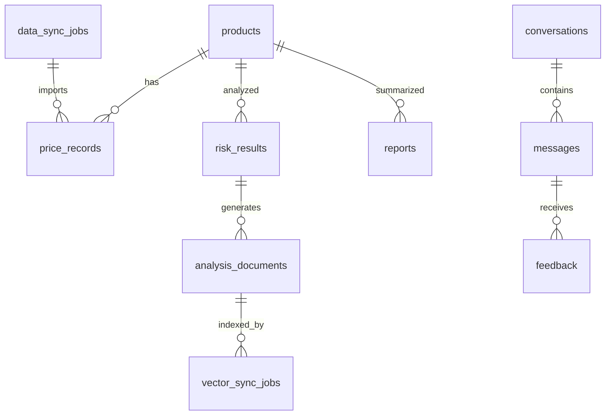

# 데이터베이스 설계

## 1. 문서 목적

이 문서는 Supabase Postgres에 저장할 핵심 테이블과 관계, 제약조건, 인덱스, Pinecone 원본 연결 기준을 정의한다.

Supabase는 이 프로젝트의 Source of Truth이며, Pinecone 벡터는 Supabase 원본 문서에서 재생성 가능한 파생 데이터로 취급한다.

## 2. 설계 원칙

1. 가격, 위험 결과, 분석 문서 원본은 Supabase에 보존한다.
2. 동일 품목·동일 날짜 가격 데이터는 중복 저장하지 않는다.
3. Pinecone 벡터는 반드시 Supabase 원본 문서 ID와 연결한다.
4. 외부 API 응답 원문 전체보다 정규화된 값과 필요한 메타데이터를 우선 저장한다.
5. 데이터 없음, 결측, 계산 불가, 시스템 오류는 구분 가능한 상태값으로 저장한다.
6. 사용자 대화와 피드백은 로그인 사용자별로 격리할 수 있게 `user_id`를 둔다.

## 3. ERD 초안



## 4. 테이블 목록

| 테이블 | 목적 | 공개 조회 | 일반 사용자 수정 |
|---|---|---|---|
| `products` | 품목 기준 정보와 KAMIS 코드 관리 | 가능 | 불가 |
| `price_records` | 날짜별 가격 데이터 | 가능 | 불가 |
| `data_sync_jobs` | 수집/분석 작업 이력 | 요약 가능 | 불가 |
| `risk_results` | 규칙 기반 위험 점수와 근거 | 가능 | 불가 |
| `analysis_documents` | 검색용 문서 원본 | 제한적 가능 | 불가 |
| `vector_sync_jobs` | Pinecone 동기화 이력 | 요약 가능 | 불가 |
| `reports` | AI 분석 보고서 | 가능 또는 로그인 필요 | 생성은 Edge Function |
| `conversations` | 사용자별 AI 대화 묶음 | 본인만 | 본인만 |
| `messages` | 사용자/AI 메시지와 근거 메타데이터 | 본인만 | 본인만 또는 Edge |
| `feedback` | AI 답변 피드백 | 본인만 | 본인만 |

## 5. 공통 컬럼 규칙

대부분의 테이블은 다음 컬럼을 둔다.

| 컬럼 | 타입 | 설명 |
|---|---|---|
| `id` | `uuid` | 기본키, `gen_random_uuid()` |
| `created_at` | `timestamptz` | 생성 시각 |
| `updated_at` | `timestamptz` | 수정 시각 |

상태값은 가능하면 `check` 제약조건으로 허용 범위를 제한한다. 구현 단계에서 PostgreSQL enum을 사용할 수도 있지만, 초기 실습에서는 `text` + `check`가 변경에 유연하다.

## 6. `products`

품목 기준 정보와 KAMIS 요청에 필요한 코드를 저장한다.

| 컬럼 | 타입 | 설명 |
|---|---|---|
| `id` | `uuid` | 기본키 |
| `display_name` | `text` | 화면 표시명 |
| `category_name` | `text` | 부류명 |
| `kamis_category_code` | `text` | KAMIS 부류 코드 |
| `kamis_item_code` | `text` | KAMIS 품목 코드 |
| `kamis_kind_code` | `text` | KAMIS 품종 코드 |
| `kamis_rank_code` | `text` | KAMIS 등급 코드 |
| `default_unit` | `text` | 기본 표시 단위 |
| `is_active` | `boolean` | 활성 여부 |
| `sort_order` | `integer` | 대시보드 정렬 |
| `metadata` | `jsonb` | 추가 코드/설명 |
| `created_at` | `timestamptz` | 생성 시각 |
| `updated_at` | `timestamptz` | 수정 시각 |

권장 제약조건:

```sql
unique (kamis_item_code, kamis_kind_code, kamis_rank_code)
```

초기 seed 후보:

| 품목 | KAMIS 품목 코드 | 메모 |
|---|---|---|
| 배추 | `211` | 우선 대상 |
| 무 | `231` | 우선 대상 |
| 양파 | `245` | 우선 대상 |
| 대파 | `274` | 품종 코드 추가 확인 필요 |

## 7. `price_records`

KAMIS에서 수집한 날짜별 가격 데이터를 저장한다.

| 컬럼 | 타입 | 설명 |
|---|---|---|
| `id` | `uuid` | 기본키 |
| `product_id` | `uuid` | `products.id` 참조 |
| `price_date` | `date` | 조사 일자 |
| `price` | `numeric(12,2)` | 정규화 가격 |
| `unit` | `text` | 가격 단위 |
| `county_code` | `text` | 지역 코드 |
| `county_name` | `text` | 지역명 |
| `market_name` | `text` | 시장명, 없으면 `NULL` |
| `product_cls_code` | `text` | `01` 소매, `02` 도매 |
| `product_cls_name` | `text` | 소매/도매 표시명 |
| `source` | `text` | 예: `KAMIS` |
| `source_action` | `text` | KAMIS action |
| `source_payload` | `jsonb` | 민감정보 제거 후 필요한 원본 필드 |
| `data_status` | `text` | `valid`, `missing`, `invalid`, `mock` |
| `is_mock` | `boolean` | Mock 데이터 여부 |
| `sync_job_id` | `uuid` | `data_sync_jobs.id` 참조 |
| `created_at` | `timestamptz` | 생성 시각 |
| `updated_at` | `timestamptz` | 수정 시각 |

권장 제약조건:

```sql
check (price is null or price >= 0)
check (data_status in ('valid', 'missing', 'invalid', 'mock'))
unique (product_id, price_date, county_code, product_cls_code, market_name, source)
```

`market_name`이 `NULL`이면 PostgreSQL unique index에서 중복으로 보지 않을 수 있으므로, 마이그레이션에서는 PostgreSQL 15 이상의 `NULLS NOT DISTINCT` unique index를 사용한다.

```sql
create unique index price_records_natural_key_idx
on public.price_records (
  product_id,
  price_date,
  county_code,
  product_cls_code,
  market_name,
  source
) nulls not distinct;
```

## 8. `data_sync_jobs`

KAMIS 수집, 위험 분석 같은 데이터 처리 작업 이력을 저장한다.

| 컬럼 | 타입 | 설명 |
|---|---|---|
| `id` | `uuid` | 기본키 |
| `job_type` | `text` | `kamis_daily`, `kamis_period`, `risk_analysis`, `document_generation` |
| `status` | `text` | `pending`, `running`, `success`, `partial_success`, `failed`, `retrying`, `skipped` |
| `triggered_by` | `text` | `cron`, `manual`, `retry`, `seed` |
| `requested_by` | `uuid` | `auth.users.id`, 수동 실행자 |
| `target_product_ids` | `uuid[]` | 대상 품목 |
| `period_start` | `date` | 대상 시작일 |
| `period_end` | `date` | 대상 종료일 |
| `total_count` | `integer` | 처리 대상 수 |
| `success_count` | `integer` | 성공 수 |
| `failed_count` | `integer` | 실패 수 |
| `skipped_count` | `integer` | 생략 수 |
| `error_summary` | `text` | 사용자용 오류 요약 |
| `error_detail` | `jsonb` | 민감정보 제거 후 상세 |
| `started_at` | `timestamptz` | 시작 시각 |
| `finished_at` | `timestamptz` | 종료 시각 |
| `created_at` | `timestamptz` | 생성 시각 |
| `updated_at` | `timestamptz` | 수정 시각 |

## 9. `risk_results`

규칙 기반 위험 점수와 계산 근거를 저장한다.

| 컬럼 | 타입 | 설명 |
|---|---|---|
| `id` | `uuid` | 기본키 |
| `product_id` | `uuid` | `products.id` 참조 |
| `period_start` | `date` | 분석 시작일 |
| `period_end` | `date` | 분석 종료일 |
| `county_code` | `text` | 분석 지역 |
| `risk_score` | `numeric(5,2)` | 최종 위험 점수 |
| `risk_grade` | `text` | `high`, `watch`, `stable`, `insufficient_data` |
| `score_version` | `text` | 계산 규칙 버전 |
| `evidence` | `jsonb` | 부분 점수, 가중치, 계산 근거 |
| `data_quality` | `jsonb` | 유효 데이터 수, 결측 비율 등 |
| `source_price_count` | `integer` | 사용 가격 행 수 |
| `sync_job_id` | `uuid` | `data_sync_jobs.id` 참조 |
| `is_latest` | `boolean` | 대시보드용 최신 여부 |
| `created_at` | `timestamptz` | 생성 시각 |
| `updated_at` | `timestamptz` | 수정 시각 |

권장 제약조건:

```sql
check (risk_score is null or (risk_score >= 0 and risk_score <= 100))
check (risk_grade in ('high', 'watch', 'stable', 'insufficient_data'))
unique (product_id, county_code, period_start, period_end, score_version)
```

`is_latest`는 품목/지역별 최신 결과를 빠르게 조회하기 위한 보조값이다. 마이그레이션 단계에서 partial unique index를 둘 수 있다.

## 10. `analysis_documents`

위험 분석 결과를 RAG 검색에 사용할 자연어 문서로 저장한다.

| 컬럼 | 타입 | 설명 |
|---|---|---|
| `id` | `uuid` | 기본키 |
| `document_type` | `text` | `risk_summary`, `price_summary`, `report` |
| `source_table` | `text` | 예: `risk_results`, `reports` |
| `source_id` | `uuid` | 원본 행 ID |
| `product_id` | `uuid` | 관련 품목 |
| `period_start` | `date` | 문서 기준 시작일 |
| `period_end` | `date` | 문서 기준 종료일 |
| `title` | `text` | 문서 제목 |
| `content` | `text` | 검색용 본문 |
| `content_hash` | `text` | 본문 hash |
| `version` | `integer` | 문서 버전 |
| `metadata` | `jsonb` | 검색 필터용 추가 정보 |
| `vector_status` | `text` | `pending`, `synced`, `failed`, `skipped` |
| `is_mock` | `boolean` | Mock 데이터 여부 |
| `created_at` | `timestamptz` | 생성 시각 |
| `updated_at` | `timestamptz` | 수정 시각 |

권장 제약조건:

```sql
check (document_type in ('risk_summary', 'price_summary', 'report'))
check (vector_status in ('pending', 'synced', 'failed', 'skipped'))
unique (source_table, source_id, document_type, version)
```

Pinecone에는 이 테이블의 `id`와 `content_hash`를 metadata로 저장한다.

## 11. `vector_sync_jobs`

Gemini 임베딩과 Pinecone upsert/query 동기화 이력을 저장한다.

| 컬럼 | 타입 | 설명 |
|---|---|---|
| `id` | `uuid` | 기본키 |
| `analysis_document_id` | `uuid` | `analysis_documents.id` 참조 |
| `status` | `text` | `pending`, `running`, `success`, `failed`, `retrying`, `skipped` |
| `pinecone_index_name` | `text` | 예: `toy-project-2` |
| `pinecone_namespace` | `text` | namespace |
| `pinecone_vector_id` | `text` | 벡터 ID |
| `embedding_model` | `text` | 예: `gemini-embedding-2` |
| `embedding_dimension` | `integer` | `1024` |
| `content_hash` | `text` | 동기화한 문서 hash |
| `error_summary` | `text` | 오류 요약 |
| `error_detail` | `jsonb` | 민감정보 제거 후 상세 |
| `started_at` | `timestamptz` | 시작 시각 |
| `finished_at` | `timestamptz` | 종료 시각 |
| `created_at` | `timestamptz` | 생성 시각 |
| `updated_at` | `timestamptz` | 수정 시각 |

권장 제약조건:

```sql
check (embedding_dimension = 1024)
unique (analysis_document_id, content_hash, pinecone_index_name, pinecone_namespace)
```

## 12. `reports`

AI가 생성한 품목별 또는 종합 분석 보고서를 저장한다.

| 컬럼 | 타입 | 설명 |
|---|---|---|
| `id` | `uuid` | 기본키 |
| `product_id` | `uuid` | 관련 품목, 종합 보고서는 `NULL` 가능 |
| `period_start` | `date` | 보고서 기준 시작일 |
| `period_end` | `date` | 보고서 기준 종료일 |
| `title` | `text` | 보고서 제목 |
| `summary` | `text` | 요약 |
| `content` | `text` | 본문 |
| `model_name` | `text` | 생성 모델 |
| `source_document_ids` | `uuid[]` | 사용 문서 ID |
| `created_by` | `uuid` | 생성 사용자 |
| `visibility` | `text` | `public`, `private` |
| `created_at` | `timestamptz` | 생성 시각 |
| `updated_at` | `timestamptz` | 수정 시각 |

보고서를 Pinecone 검색 대상으로 삼을 경우 `analysis_documents`에 `document_type = 'report'`로 별도 원본 문서를 생성한다.

## 13. `conversations`

사용자별 AI 질의응답 대화 묶음을 저장한다.

| 컬럼 | 타입 | 설명 |
|---|---|---|
| `id` | `uuid` | 기본키 |
| `user_id` | `uuid` | `auth.users.id` |
| `title` | `text` | 대화 제목 |
| `last_message_at` | `timestamptz` | 마지막 메시지 시각 |
| `created_at` | `timestamptz` | 생성 시각 |
| `updated_at` | `timestamptz` | 수정 시각 |

RLS 기준은 `user_id = auth.uid()`이다.

## 14. `messages`

사용자 질문, AI 답변, 근거 메타데이터를 저장한다.

| 컬럼 | 타입 | 설명 |
|---|---|---|
| `id` | `uuid` | 기본키 |
| `conversation_id` | `uuid` | `conversations.id` 참조 |
| `user_id` | `uuid` | `auth.users.id` |
| `role` | `text` | `user`, `assistant`, `system` |
| `content` | `text` | 메시지 내용 |
| `model_name` | `text` | AI 답변 생성 모델 |
| `period_start` | `date` | 답변에 사용한 시작일 |
| `period_end` | `date` | 답변에 사용한 종료일 |
| `evidence_document_ids` | `uuid[]` | 사용한 분석 문서 ID |
| `data_limitations` | `jsonb` | 데이터 한계 |
| `status` | `text` | `success`, `failed`, `insufficient_evidence` |
| `error_summary` | `text` | 실패 요약 |
| `created_at` | `timestamptz` | 생성 시각 |
| `updated_at` | `timestamptz` | 수정 시각 |

권장 제약조건:

```sql
check (role in ('user', 'assistant', 'system'))
check (status in ('success', 'failed', 'insufficient_evidence'))
```

## 15. `feedback`

AI 답변에 대한 사용자 피드백을 저장한다.

| 컬럼 | 타입 | 설명 |
|---|---|---|
| `id` | `uuid` | 기본키 |
| `message_id` | `uuid` | `messages.id` 참조 |
| `user_id` | `uuid` | `auth.users.id` |
| `rating` | `text` | `up`, `down`, `neutral` |
| `comment` | `text` | 선택 입력 |
| `created_at` | `timestamptz` | 생성 시각 |
| `updated_at` | `timestamptz` | 수정 시각 |

권장 제약조건:

```sql
check (rating in ('up', 'down', 'neutral'))
unique (message_id, user_id)
```

## 16. 주요 조회 인덱스 후보

| 테이블 | 인덱스 후보 | 목적 |
|---|---|---|
| `products` | `(is_active, sort_order)` | 활성 품목 대시보드 조회 |
| `price_records` | `(product_id, price_date desc)` | 품목별 가격 추이 |
| `price_records` | `(county_code, price_date desc)` | 지역별 최신 가격 |
| `risk_results` | `(product_id, county_code, is_latest)` | 대시보드 최신 위험 결과 |
| `risk_results` | `(period_start, period_end)` | 기간별 분석 조회 |
| `analysis_documents` | `(product_id, document_type, period_end desc)` | 문서 조회 |
| `analysis_documents` | `(vector_status, updated_at)` | 벡터 동기화 대상 조회 |
| `data_sync_jobs` | `(job_type, status, created_at desc)` | 시스템 상태 화면 |
| `vector_sync_jobs` | `(status, created_at desc)` | 벡터 재처리 대상 |
| `conversations` | `(user_id, last_message_at desc)` | 사용자 대화 목록 |
| `messages` | `(conversation_id, created_at)` | 대화 메시지 조회 |

## 17. Pinecone 연결 기준

Pinecone 벡터 하나는 Supabase 원본 문서 하나와 연결한다.

| Pinecone 항목 | Supabase 기준 |
|---|---|
| vector id | `analysis_document:{id}:v{version}` |
| metadata `analysis_document_id` | `analysis_documents.id` |
| metadata `content_hash` | `analysis_documents.content_hash` |
| metadata `product_id` | `analysis_documents.product_id` |
| metadata `period_start/end` | `analysis_documents.period_start/end` |

Pinecone 검색 결과를 사용자에게 보여줄 때는 metadata만 신뢰하지 않고 Supabase `analysis_documents`를 다시 조회해 제목, 본문 요약, 기간, 데이터 한계를 표시한다.

## 18. 다음 마이그레이션 작성 순서

1. `pgcrypto` 확장 확인 또는 활성화
2. `updated_at` 자동 갱신 함수 작성
3. `products` 생성
4. `data_sync_jobs` 생성
5. `price_records` 생성과 unique index 작성
6. `risk_results` 생성
7. `analysis_documents` 생성
8. `vector_sync_jobs` 생성
9. `reports` 생성
10. `conversations`, `messages`, `feedback` 생성
11. RLS 활성화와 정책 작성
12. `supabase/seed.sql`에 초기 품목 후보 작성
