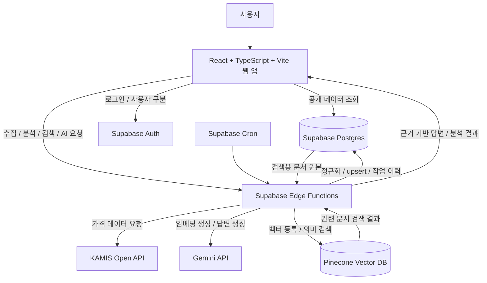
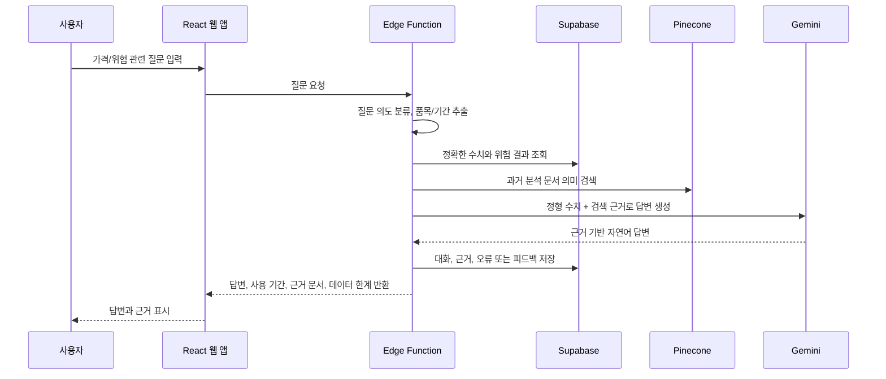
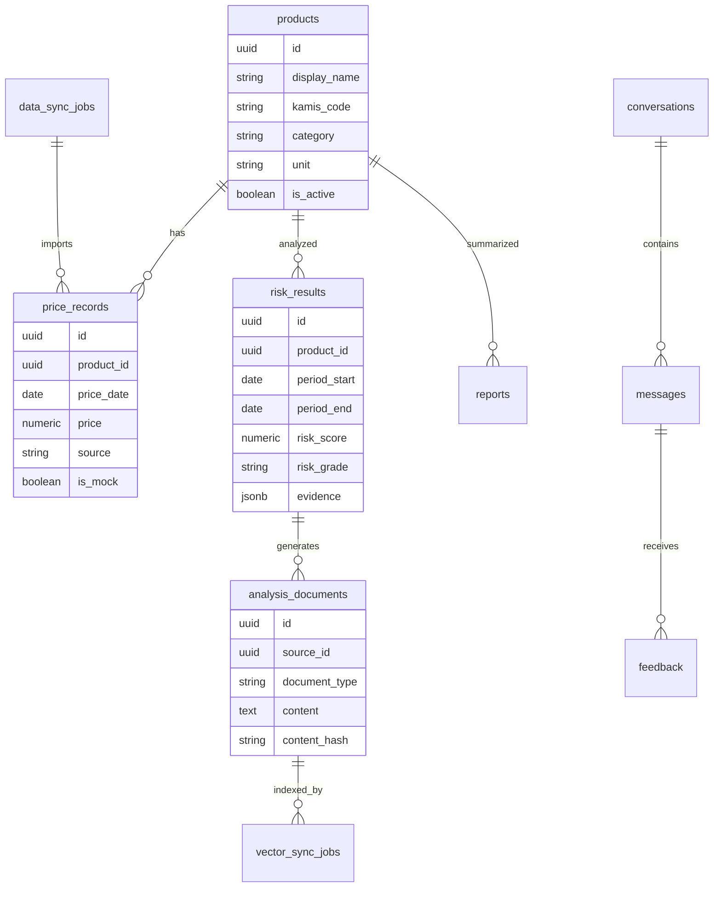

# 전남 특산 농수산물 가격 변동 및 수급 위험 분석 시스템 개요 보고서

## 1. 문서 확인 요약

`document` 폴더에는 다음 2개 문서가 포함되어 있다.

| 파일 | 성격 | 핵심 내용 |
|---|---|---|
| `tech_stack_PRD.txt` | 기술 스택 요구사항 정의서 | React, Supabase, Pinecone, Gemini, KAMIS 기반의 기술 구성과 보안 원칙 정의 |
| `[토이프로젝트2-실습안내]jeonnam_agri_prd_first_student_practice_utf8.pdf` | PRD 우선 실습 안내서 | 문제 정의부터 PRD, 설계, 구현, 테스트, 최종 문서화까지의 단계별 수행 기준 제시 |

두 문서의 공통 메시지는 명확하다. 이 프로젝트는 단순한 화면 구현이 아니라, 전남 특산 농수산물의 가격 데이터 수집, 위험 분석, 의미 검색, 근거 기반 AI 질의응답을 PRD 중심으로 설계하고 검증하는 웹 애플리케이션 실습이다.

## 2. 프로젝트 개요

본 프로젝트는 KAMIS Open API에서 전남 특산 농수산물 가격 데이터를 수집하고, Supabase Postgres에 기준 데이터를 저장한 뒤, 규칙 기반 위험 점수를 계산하여 사용자에게 가격 추이와 수급 위험 정보를 제공하는 시스템이다.

사용자는 웹 화면에서 품목별 최신 가격, 기간별 가격 추이, 변동률, 위험 등급, 계산 근거를 확인할 수 있다. 또한 AI 질의응답을 통해 가격 변화 원인, 과거 유사 사례, 위험 해석 등을 자연어로 질문하고, 답변에 사용된 데이터 기간과 근거 문서를 함께 확인할 수 있다.

## 3. 전체 시스템 개요도

## 4. 기술 구성과 책임 분리

| 구성 요소 | 역할 |
|---|---|
| React + TypeScript + Vite | 대시보드, 가격 차트, 위험 분석 화면, AI 질의응답, 로딩/오류/빈 데이터 상태 표시 |
| Supabase Postgres | 품목 정보, 가격 데이터, 위험 결과, 검색 문서 원본, 작업 이력, 보고서, 대화/피드백 저장 |
| Supabase Edge Functions | KAMIS 호출, 데이터 파싱/검증/저장, 위험 점수 계산, Gemini 호출, Pinecone 연동, 비밀키 보호 |
| Supabase Auth / RLS | 로그인 사용자 구분, 사용자별 대화/피드백 격리, 공개 데이터와 관리자 작업 권한 분리 |
| Supabase Cron | 정기 데이터 수집 및 분석 작업 실행 |
| Pinecone | 가격 변화 요약, 위험 분석 문서, 보고서 등을 벡터화하여 의미 기반 검색 제공 |
| Gemini API | 임베딩 생성, RAG 기반 답변 생성, 위험 분석 자연어 설명, AI 보고서 생성 |
| KAMIS Open API | 농수산물 일별 도소매 가격 데이터 제공 |

중요한 제약은 별도 FastAPI 또는 Express 백엔드 서버를 사용하지 않는다는 점이다. 브라우저는 KAMIS, Pinecone, Gemini를 직접 호출하지 않으며, 모든 외부 API 비밀키는 Supabase Edge Functions의 Secrets에서만 관리해야 한다.

## 5. 데이터 흐름 개요도

```mermaid
flowchart LR
    A[수동 실행 또는 Cron] --> B[수집 작업 생성]
    B --> C[KAMIS 호출]
    C --> D[응답 파싱 / 정규화 / 검증]
    D --> E[Supabase 가격 데이터 upsert]
    E --> F[위험 분석 대상 등록]
    F --> G[규칙 기반 위험 점수 계산]
    G --> H[위험 결과 저장]
    H --> I[검색용 문서 생성]
    I --> J[Gemini 임베딩 생성]
    J --> K[Pinecone upsert]
    K --> L[벡터 동기화 상태 기록]
```

핵심 데이터 원칙은 Supabase가 기준 데이터 저장소라는 점이다. Pinecone은 Supabase 원본으로부터 만들어지는 파생 검색 인덱스이며, Pinecone 데이터가 삭제되더라도 Supabase 원본을 통해 재구축할 수 있어야 한다.

## 6. AI 질의응답 처리 흐름

수치 질문은 Supabase의 정형 데이터를 우선 사용하고, 원인 설명이나 과거 유사 사례 질문은 Pinecone 의미 검색을 활용한다. AI 답변은 근거, 기간, 데이터 한계가 함께 표시되어야 하며, 근거가 부족한 경우 사실을 만들어내지 않아야 한다.

## 7. 주요 기능 범위

### Must Have 후보

| 영역 | 기능 |
|---|---|
| 품목 조회 | 활성 전남 특산품 목록 조회 |
| 데이터 수집 | KAMIS 가격 데이터 수집 및 저장 |
| 중복 방지 | 동일 품목·동일 날짜 가격 데이터 upsert |
| 가격 분석 | 품목별 기간 가격 추이, 평균, 최고가, 최저가, 변화율 조회 |
| 위험 분석 | 규칙 기반 위험 점수, 등급, 계산 근거 제공 |
| 벡터 검색 | 분석 문서를 Pinecone에 등록하고 검색 |
| AI 답변 | Supabase 수치와 Pinecone 문서를 활용한 근거 기반 자연어 답변 |
| 근거 표시 | 답변에 사용된 데이터 기간, 근거 문서, 데이터 한계 표시 |

### Should Have 후보

| 영역 | 기능 |
|---|---|
| 시스템 상태 | 수집, 분석, 인덱싱 성공/실패 상태 확인 |
| 피드백 | AI 답변에 대한 사용자 피드백 저장 |
| 재처리 | 실패한 수집 또는 벡터 동기화 작업만 재처리 |
| 보고서 | 품목별 또는 종합 AI 분석 보고서 생성 및 저장 |

### 제외 범위 후보

| 항목 | 제외 이유 |
|---|---|
| 미래 가격 예측 | 실습 범위를 넘고 검증 부담이 큼 |
| 자동 거래 또는 매매 | 서비스 목적과 맞지 않음 |
| 결제 | 가격 분석 시스템의 핵심 기능이 아님 |
| 모바일 네이티브 앱 | 웹 앱 구현 범위 밖 |
| 운영 배포 | 기본 실습 범위에서 제외 |
| 별도 FastAPI / Express 서버 | 기술 제약상 사용 금지 |

## 8. 핵심 데이터 모델 후보

최소 엔터티 후보는 `products`, `price_records`, `data_sync_jobs`, `risk_results`, `analysis_documents`, `vector_sync_jobs`, `reports`, `conversations`, `messages`, `feedback`이다. 가격 데이터는 동일 품목·동일 날짜 기준으로 중복이 방지되어야 하며, 위험 점수와 상태값은 허용 범위가 제한되어야 한다.

## 9. 단계별 추진 개요

| 단계 | 목적 | 주요 산출물 |
|---|---|---|
| Phase 0 | 문제 정의 | `docs/01-planning/problem-definition.md` |
| Phase 1 | 사용자 및 이해관계자 분석 | `docs/01-planning/users-and-stakeholders.md` |
| Phase 2 | 사용자 시나리오와 흐름 | `docs/01-planning/user-flow.md` |
| Phase 3 | PRD 작성 | `docs/01-planning/PRD.md` |
| Phase 4 | PRD 검토 및 범위 확정 | 승인된 PRD, 변경 이력 |
| Phase 5 | 요구사항 추적 | `docs/01-planning/requirements-traceability.md` |
| Phase 6 | 아키텍처 설계 | `docs/03-design/architecture.md` |
| Phase 7 | 데이터 워크플로 설계 | `docs/03-design/data-workflow.md` |
| Phase 8 | 저장소 및 개발환경 준비 | `frontend/`, `supabase/`, `.env.example` |
| Phase 9~10 | DB 모델과 RLS | 마이그레이션, 보안 정책 |
| Phase 11~14 | 품목 기준, 수집, 품질, 위험 분석 | Edge Functions, 위험 계산 |
| Phase 15~19 | Pinecone, 문서화, RAG | 벡터 설계, 동기화, 질의응답 |
| Phase 20~24 | React 화면 구현 | 대시보드, 가격, 위험, 보고서, 채팅, 시스템 상태 |
| Phase 25~27 | 테스트, 통합 검증, 최종 문서화 | `docs/04-validation/test-report.md`, `README.md`, `WORKLOG.md` |

## 10. 보안 및 품질 원칙

1. 브라우저 번들에 외부 API 비밀키가 포함되면 안 된다.
2. KAMIS, Gemini, Pinecone 호출은 Edge Functions를 통해서만 수행한다.
3. RLS를 적용하여 사용자가 다른 사용자의 대화와 피드백을 조회하지 못하게 한다.
4. 일반 사용자는 가격 원본과 위험 결과를 수정할 수 없어야 한다.
5. 일부 품목 수집 실패가 전체 작업 실패로 이어지지 않아야 한다.
6. 데이터 없음과 값 0은 명확히 구분해야 한다.
7. 위험 점수는 AI가 아니라 규칙 기반으로 재현 가능하게 계산한다.
8. AI는 계산 결과를 설명하고, 근거와 데이터 한계를 표시하는 역할을 맡는다.
9. Pinecone 동기화 실패가 Supabase 원본 데이터를 훼손하면 안 된다.
10. 모든 Must Have 요구사항은 구현물과 테스트에 연결되어야 한다.

## 11. 예상 리스크

| 리스크 | 대응 방향 |
|---|---|
| KAMIS 응답 구조 변경 | 파싱 로직 분리, 응답 검증, 오류 작업 이력 저장 |
| 휴장일 또는 데이터 없음 | 빈 데이터와 시스템 오류 상태 분리 |
| API 호출 한도 | Cron 주기 조정, 수동 실행 제한, Mock 모드 구분 |
| Edge Function 실행 제한 | 작업 단위 분리, 품목별 부분 실패 처리 |
| 임베딩 차원 불일치 | Gemini 임베딩 모델과 Pinecone 인덱스 차원 사전 확인 |
| 벡터 검색 관련도 부족 | 문서 템플릿과 메타데이터 필터 개선 |
| AI의 근거 없는 생성 | 정형 수치와 검색 근거만 구조화해 전달, 근거 없음 상태 명시 |
| 무료 요금제 용량 제한 | 저장 기간, 대상 품목 수, 문서 분할 기준을 PRD에서 제한 |

## 12. 결론

이 프로젝트의 핵심은 Supabase를 기준 데이터 저장소로 두고, Edge Functions를 서버리스 처리 계층으로 사용하며, Pinecone과 Gemini를 통해 의미 검색과 근거 기반 AI 답변을 제공하는 것이다.

구현의 첫 단계는 프론트엔드나 DB부터 만드는 것이 아니라 문제 정의, 사용자 분석, PRD 작성, 요구사항 추적표를 먼저 완성하는 것이다. 이후 아키텍처, 데이터 워크플로, DB/RLS, 수집 함수, 위험 분석, Pinecone 동기화, RAG 질의응답, React 화면, 테스트 순서로 진행해야 문서의 실습 의도와 맞다.

최종 완성 기준은 단순히 화면이 보이는 것이 아니라, 모든 Must Have 요구사항이 구현 및 테스트와 연결되고, 비밀키 보호, RLS, 중복 방지, 위험 점수 재현성, Supabase-Pinecone 정합성, AI 답변의 근거 표시가 검증되는 상태다.
